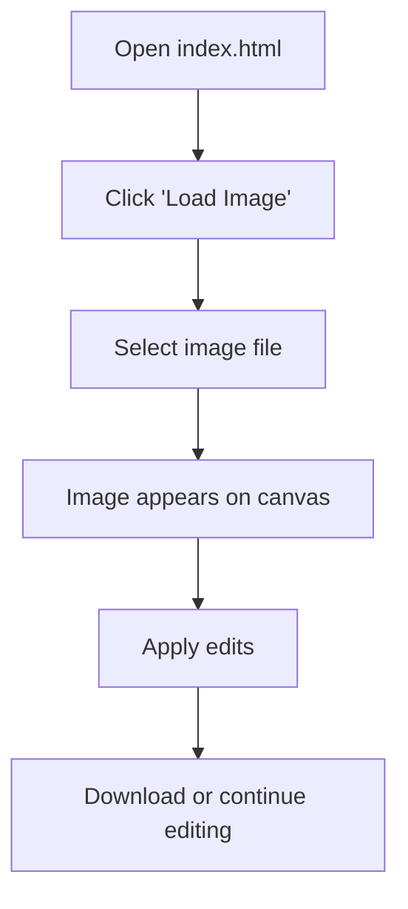
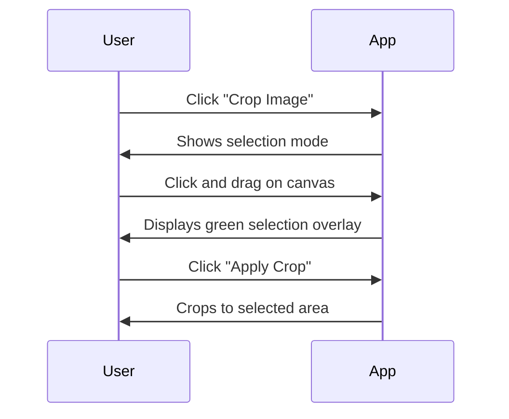
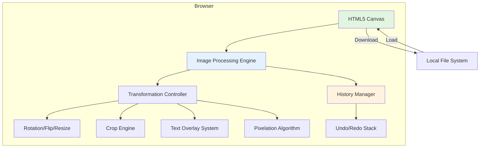

# xsukax Photo Editor

A powerful, privacy-focused browser-based photo editor that runs entirely client-side with zero server communication. Edit images, add text, apply pixelation for privacy, and more—all without uploading your photos anywhere.


## 🎯 Project Overview

xsukax Photo Editor is a single-file web application that provides comprehensive image editing capabilities directly in your browser. Built with vanilla JavaScript and the HTML5 Canvas API, it offers professional-grade features including rotation, cropping, resizing, text overlays, and selective pixelation—all while maintaining complete user privacy through client-side processing.

The application is designed with simplicity and security at its core: no installation required, no external dependencies, no data collection, and no server uploads. Your images never leave your device.

## 🔒 Security and Privacy Benefits

xsukax Photo Editor prioritizes user privacy and data security through multiple architectural design choices:

- **100% Client-Side Processing**: All image manipulation occurs locally in your browser using the HTML5 Canvas API. No images are ever uploaded to external servers.

- **Zero Data Collection**: The application does not track, store, or transmit any user data, metadata, or usage statistics.

- **No External Dependencies**: Built entirely with vanilla JavaScript without relying on third-party libraries or CDN-hosted resources, eliminating supply chain vulnerabilities and external tracking.

- **Offline Capability**: Once loaded, the application functions completely offline, ensuring your editing sessions remain private even without internet connectivity.

- **Single-File Architecture**: The entire application is contained in one HTML file (`index.html`), making it easy to audit, verify, and self-host with complete transparency.

- **Browser Sandbox Security**: Operates within the browser's security sandbox, preventing unauthorized system access or file operations.

- **No Cookies or Local Storage**: Does not create cookies or persist data to browser storage, leaving no trace of your editing activity.

These security measures make xsukax Photo Editor ideal for handling sensitive images, personal photos, or any content requiring confidentiality.

## ✨ Features and Advantages

### Core Editing Features
- **Image Cropping**: Intuitive click-and-drag rectangular selection with visual overlay
- **Precision Rotation**: Rotate images by any degree value (0-360°) or use quick 90°/180° buttons
- **Image Flipping**: Horizontal and vertical flip transformations
- **Intelligent Resizing**: Scale images with optional aspect ratio locking and high-quality anti-aliasing
- **Text Overlays**: Add customizable text with adjustable font size, color, and drag-to-position functionality
- **Privacy Pixelation**: Selectively pixelate areas (faces, license plates, etc.) with adjustable pixel size

### Advanced Capabilities
- **Undo/Redo System**: Full history management supporting up to 20 states with one-click reversion
- **High-Quality Rendering**: Smart image smoothing algorithms maintain clarity when resizing or transforming
- **Multi-Layer Support**: Work with text overlays independently before committing changes
- **Precise Selection Tools**: Pixel-accurate selection overlay with visual feedback

### User Experience
- **Zero Installation**: Run directly in any modern web browser—no downloads or installations required
- **GitHub-Inspired UI**: Clean, minimalist interface with intuitive controls and visual hints
- **Responsive Design**: Adapts to different screen sizes for desktop and tablet use
- **Real-Time Preview**: See changes immediately as you adjust parameters
- **One-Click Download**: Export edited images as PNG files with a single click

### Technical Advantages
- **Lightweight**: Single HTML file with no external resources
- **Cross-Platform**: Works on Windows, macOS, Linux, ChromeOS, and any OS with a modern browser
- **No Registration**: Start editing immediately without creating accounts or signing in
- **Open Source**: Fully transparent, auditable code under GPL-3.0 license
- **Framework-Free**: Pure vanilla JavaScript ensures longevity and maintainability

## 📦 Installation Instructions

xsukax Photo Editor requires no traditional installation. Choose one of the following methods:

### Method 1: Direct Browser Use (Recommended)
1. Download `index.html` from this repository
2. Open the file in any modern web browser (Chrome, Firefox, Safari, Edge)
3. Start editing immediately

### Method 2: Self-Hosting
For local network or team deployment:

```bash
# Clone the repository
git clone https://github.com/xsukax/xsukax-Photo-Editor.git

# Navigate to the directory
cd xsukax-Photo-Editor

# Serve with any HTTP server (example using Python)
python3 -m http.server 8000

# Access at http://localhost:8000
```

### Method 3: GitHub Pages Deployment
Fork this repository and enable GitHub Pages in repository settings to create your own hosted instance.

### Browser Requirements
- Chrome/Edge 90+ (recommended)
- Firefox 88+
- Safari 14+
- Any modern browser with HTML5 Canvas API support

## 📖 Usage Guide

### Getting Started



### Basic Workflow

1. **Load Image**: Click the "Load Image" button and select a photo from your device
2. **Apply Transformations**: Use rotation, flip, or resize controls
3. **Edit Content**: Crop unwanted areas, add text, or pixelate sensitive regions
4. **Review**: Use Undo/Redo to perfect your edits
5. **Export**: Click "Download" to save your edited image

### Feature-Specific Instructions

#### Cropping Images


1. Click **"✂️ Crop Image"**
2. Click and drag on the canvas to select the area to keep
3. Green overlay shows your selection
4. Click **"✓ Apply Crop"** or **"✕ Cancel"**

#### Adding Text
1. Click **"📝 Add Text"**
2. Enter text content in the modal dialog
3. Adjust font size (10-200px) and color
4. Click **"Add Text"** to place it at the center
5. Click and drag the text to reposition it anywhere on the image

#### Pixelating Areas (Privacy Mode)


1. Click **"🔲 Pixelate Area"**
2. Adjust **Pixel Size** slider (5-50)
3. Click and drag to select area to pixelate
4. Selection pixelates automatically when you release
5. Repeat for multiple areas
6. Click **"✓ Done Pixelating"** when finished

#### Resizing Images
1. Click **"📐 Resize Image"**
2. Enter new dimensions (width/height)
3. Toggle **"Maintain aspect ratio"** as needed
4. Click **"Apply Resize"**

**Note**: The editor uses high-quality anti-aliasing to maintain image clarity when resizing, even when scaling down.

#### Rotation and Flipping
- **Manual Rotation**: Enter any degree value (0-360) in the input field
- **Quick Rotate**: Click **"↻ 90°"** or **"↻ 180°"** for instant rotation
- **Flip**: Use **"⇄ Flip H"** (horizontal) or **"⇅ Flip V"** (vertical)

#### Using Undo/Redo
- **↶ Undo**: Revert the last committed change (up to 20 steps back)
- **↷ Redo**: Restore a change after undo

Buttons are automatically disabled when no more history is available.

### Application Architecture



### Keyboard Shortcuts
Currently, the application uses mouse-based controls. Future versions may include keyboard shortcuts for advanced users.

### Tips for Best Results
- **Image Quality**: Load high-resolution images for best editing results
- **Pixelation**: Use larger pixel sizes (20-40) for stronger privacy obscuration
- **Text Visibility**: White text with drop shadow works best on dark images
- **History**: Each committed operation saves to history; temporary actions like dragging text don't save until finalized
- **Browser Zoom**: If canvas appears small, use browser zoom (Ctrl/Cmd + "+") to enlarge the interface

## 📄 Licensing Information

This project is licensed under the GNU General Public License v3.0.

## 🤝 Contributing

Contributions are welcome! Please feel free to submit pull requests, report bugs, or suggest features through GitHub Issues.

### Development Guidelines
- Maintain the single-file architecture
- Avoid external dependencies
- Follow existing code style and patterns
- Test across multiple browsers
- Document new features in the README

## 🔧 Technical Details

### Technology Stack
- **HTML5 Canvas API**: Core image manipulation
- **Vanilla JavaScript (ES6+)**: All application logic
- **CSS3**: User interface styling
- **No frameworks or libraries**: Pure web standards

### Browser Storage
The application deliberately does **not** use:
- localStorage
- sessionStorage
- IndexedDB
- Cookies

This design choice ensures complete privacy and leaves no trace of user activity.

### Performance Considerations
- Efficient canvas operations with minimal redraws
- Smart image smoothing for quality vs. performance balance
- History management with 20-state limit to control memory usage
- Optimized pixelation algorithm for real-time feedback

## 🐛 Known Limitations

- Maximum history: 20 undo/redo states
- Large images (>4000x4000px) may experience slower processing on older hardware
- Text positioning requires manual dragging (no numeric coordinate input)
- Mobile touch support is limited; designed primarily for desktop/tablet use

## 📞 Support

For bug reports, feature requests, or questions:
- **GitHub Issues**: https://github.com/xsukax/xsukax-Photo-Editor/issues
- **Repository**: https://github.com/xsukax/xsukax-Photo-Editor

## 🌟 Acknowledgments

Built with privacy and user empowerment in mind. Special thanks to the open-source community for inspiration and the web standards that make client-side applications like this possible.

---

**Made with ❤️ for privacy-conscious users**
